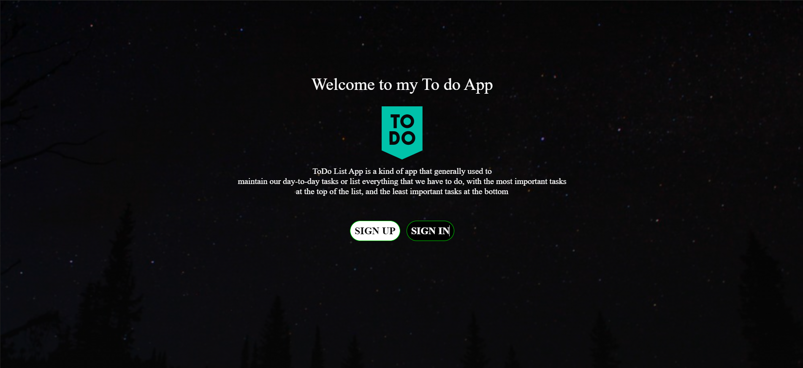
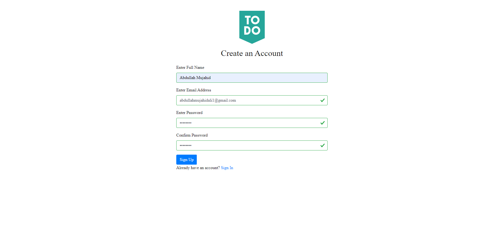
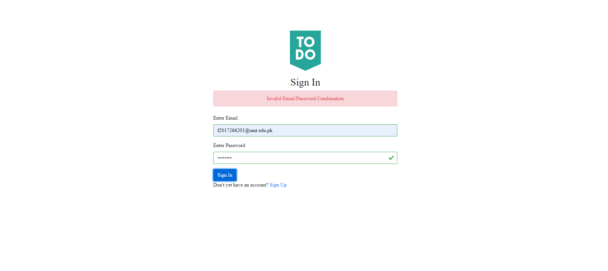
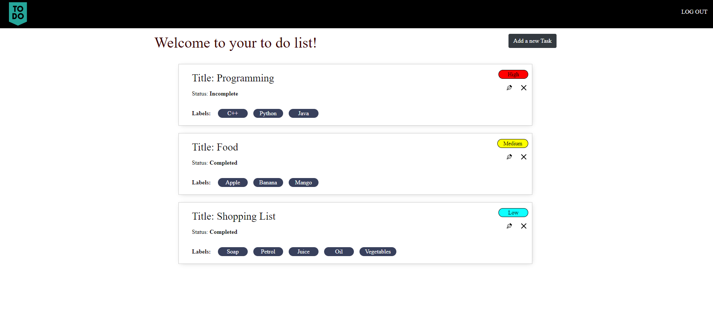
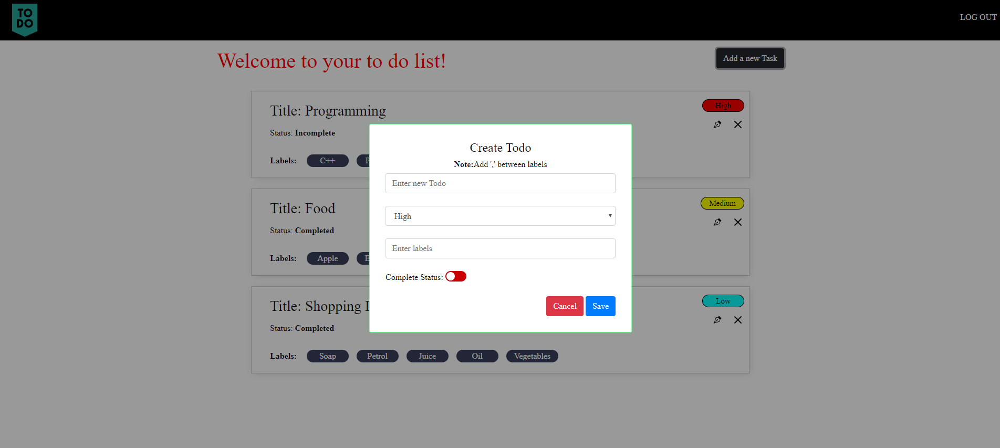

#  PERN To Do App (Full Stack)


[](https://github.com//abdullahmujahidali/PERN-ToDoApp)
[](https://opensource.com/users/abdullahmujahidali)
[](https://www.python.org/)
[](https://github.com/abdullahmujahidali//abdullahmujahidali/PERN-ToDoApp/blob/master/LICENSE)
[](https://github.com/abdullahmujahidali)
[](https://twitter.com/abdulladgaf)

Please consider following this project's author, [Abdullah Mujahid](https://github.com/abdullahmujahidali), and consider starring the project to show your :heart: and support.


## Built With PERN ( PostgreSQL Express React Node )

* [React JS](https://reactjs.org/)
* [Express JS](https://expressjs.com/)
* [Node  JS](https://nodejs.org/en/)
* [Postgre SQL](https://www.postgresql.org/)


## Project Features.
* User can register & login into the web application.
* User can create a to do task by adding its priority, labels, title and a status of complete.
* User can create a task.
* User can delete a task.
* User can view a task.
* User can set priority of a task.
* User can search a task.


## Prerequisites
* Node JS
* Postgres SQL 


## Steps to run this application
* Clone:
```bash
        ∧∧
　　 ( ´◔ω◔`)　＜・・・・・・ $ git clone https://github.com/abdullahmujahidali/PERN-ToDoApp.git
　 ＿|　⊃／(＿＿
／　└-(＿＿＿_／
￣￣￣￣￣￣￣

　＜⌒／ヽ-､＿＿ 　 　　*thanks
／＜_/＿＿＿＿／

```

## How to run this application.
* Clone this repo
* In the root directory of this project open terminal and enter run npm install. This will install all the packages necessary for the application
* To start the backend server you have to open terminal and enter the command      `npm run dev`
* Now in order to run cliend side open another terminal tab and run cd client to change into the client directory.
* When you are inside the client directory run  `npm install`   again to install dependencies for the client side.
* When you are done with that now run    `npm start`  to completely start the application.


## IMPORTANT COMMANDS DEFINED THAT YOU SHOULD KNOW.
* `npm run migrate:all` is responsible for db:migrate:undo:all and db:migrate
* `npm run dev` is to run server side.
* `npm start` is to run client side.


<<<<<<< HEAD
## SCREENSHOTS OF USER INTERFACE
### LANDING

=======

>>>>>>> origin/main

### SIGN UP



### SIGN IN



### HOME



### CREATE


### Author

**Abdullah Mujahid**

* [LinkedIn Profile](https://https://www.linkedin.com/in/abdullah-mujahid-211849186/)
* [GitHub Profile](https://github.com/abdullahmujahidali)
* [Twitter Profile](https://twitter.com/abdulladgaf)

### License
Copyright © 2021, [Abdullah Mujahid](https://github.com/abdullahmujahidali).
Released under the [MIT License](LICENSE).

